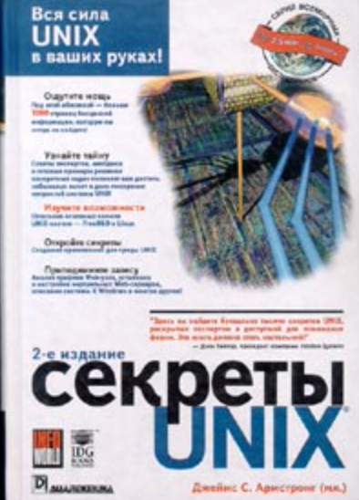

# pet_project
UNIX SECRETS

«Секреты UNIX» — книга Джеймса С. Армстронга, младшего, выпущенная издательством «Вильямс» в 2000 году. 
Цель издания — помочь опытным пользователям UNIX стать настоящими экспертами. Автор описывает основы функционирования системы, излагая не только сведения о командах, но и подробно анализируя процессы, происходящие в системе.

Некоторые темы, которые рассматриваются в книге:

- учётные записи пользователей;
- командные оболочки;
- операции с файлами;
- разработка приложений, компиляторов и средств синтаксического анализа.

Книга состоит из 12 частей, в каждой из которых подробно рассматриваются определённые свойства UNIX.  2

Количество страниц — 1072, формат издания — 70x100/16, тираж — 4000, ISBN — 5-8459-0068-9, 0-7645-3320-7. 1

